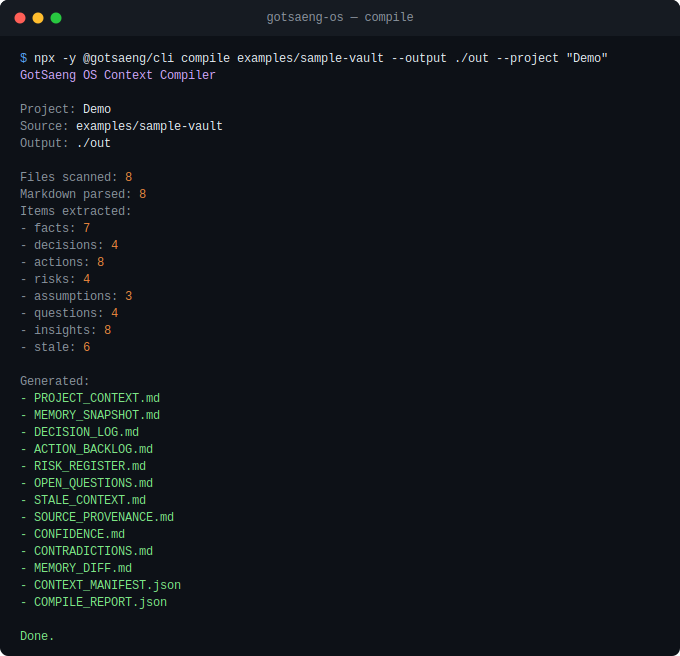

# GotSaeng OS

**GotSaeng OS 生**

Compile your scattered Markdown notes into model-ready context packs — local-first, no telemetry, no cloud.

**Reclaim your scattered life. 흩어진 생을 다시 손에 쥐다.**

[](https://www.npmjs.com/package/@gotsaeng/cli)
[](https://github.com/wonkwonlee/gotsaeng-os/actions/workflows/ci.yml)
[](https://opensource.org/licenses/MIT)
[](https://nodejs.org/)
[](https://github.com/wonkwonlee/gotsaeng-os/blob/main/SECURITY.md)

## Quick Start

> Requires Node.js 20 or newer. No install needed.

```bash
npx -y @gotsaeng/cli@0.10.7 compile <vault> --output <dir> --project "<name>"
```

Both `--output` and `--project` are required flags. Copy-paste example using the included sample vault:

```bash
npx -y @gotsaeng/cli@0.10.7 compile ./examples/sample-vault --output ./out --project "GotSaeng OS"
```

This writes 13 artifacts to `./out/` including `PROJECT_CONTEXT.md`, `MEMORY_SNAPSHOT.md`,
`DECISION_LOG.md`, `MEMORY_DIFF.md`, `COMPILE_REPORT.json`, and more.

## See it in action



See [examples/README.md](./examples/README.md) for the full sample vault walkthrough and expected
output.

## What GotSaeng OS Does

| Capability | What it does |
| --- | --- |
| **Vault scanning** | Recursively scans a local Markdown vault |
| **Note classification** | Classifies notes into project, decision, research, weekly review, chat export, and template types |
| **Extraction** | Extracts facts, decisions, actions, risks, assumptions, questions, insights, and stale context |
| **Context pack output** | Writes auditable Markdown + JSON artifacts with source coverage stats |
| **Memory diff** | Deterministic local diff comparing previous and current compile manifests |
| **Provenance scoring** | Scores extracted items from local metadata — a heuristic for triage, not semantic verification |
| **Confidence scoring** | Scores extraction reliability from deterministic local signals only |
| **Contradiction candidates** | Surfaces candidate cues for human review — a review queue, not a semantic engine |
| **Obsidian adapter** | Desktop-only plugin with Report Hub view, hidden output folder, and vault commands |
| **CLI** | Published as `@gotsaeng/cli` — no global install required via npx |

<details>
<summary>Full v0.10 feature list</summary>

- Scans a local Markdown vault.
- Parses YAML frontmatter with `gray-matter`.
- Classifies notes into project, decision, research, weekly review, chat export, template,
  and unknown types.
- Extracts explicit facts, decisions, actions, risks, assumptions, questions, and insights.
- Extracts plain Obsidian task lists and common section patterns such as `Summary`,
  `Key Points`, `Open Questions`, `Contradictions / Uncertainty`, and source metadata.
- Detects stale context from `updated` dates and open actions.
- Writes Markdown and JSON context-pack output with extraction and source coverage stats.
- Adds a desktop-only Obsidian adapter scaffold that calls the same core compiler.
- Adds Obsidian commands for context-pack compilation, weekly review context, LLM handoff export,
  and vault validation.
- Adds a plugin-specific `REPORT_HUB.md` with Obsidian wikilinks back to source notes.
- Adds an Obsidian Report Hub view with command buttons, report shortcuts, latest compile metrics,
  and a ribbon icon.
- Lets the Report Hub view preview generated Markdown and JSON output files even when the output
  folder is hidden from Obsidian's file explorer.
- Adds an Obsidian setting for hidden, visible, or custom output folder placement.
- Writes `CONTEXT_MANIFEST.json` as a local item manifest for deterministic memory diffs.
- Writes `MEMORY_DIFF.md` by comparing the previous compile manifest against the current compile.
- Surfaces newly added, changed, newly stale, and resolved context without calling any AI service.
- Adds deterministic source provenance scoring for extracted items.
- Writes `SOURCE_PROVENANCE.md` with strong/weak provenance items and scoring warnings.
- Records aggregate `provenanceStats` in `COMPILE_REPORT.json`.
- Writes `CONFIDENCE.md` with deterministic extraction-confidence scoring and warnings.
- Records aggregate `confidenceStats` in `COMPILE_REPORT.json`.
- Writes `CONTRADICTIONS.md` with deterministic contradiction, conflict, and uncertainty
  candidates for human review.
- Records aggregate `contradictionStats` in `COMPILE_REPORT.json`.
- Groups memory-diff details by source note so changed context is easier to review.
- Calibrates source provenance scoring into strong, moderate, and weak buckets with a visible
  calibration version.
- Adds source-note buttons inside the Obsidian Report Hub preview so generated reports can jump
  back to original vault notes even when output lives in a hidden folder.
- Infers the current objective from project notes or high-priority open actions.
- Groups decisions, risks, and questions by source for faster review.
- Adds warning triage to Markdown and JSON reports.
- Produces a cleaner high-signal weekly review surface in the Obsidian adapter.

</details>

## What v0.10 Does Not Do

v0.10 does not include SaaS, cloud sync, auth, payments, vector databases, RAG, LLM API calls,
OpenAI/Anthropic/Gemini SDKs, autonomous research, a browser extension, a mobile app, or a rich
Obsidian-native management UI.

Autonomous research is a long-term research direction, not a v0.10 capability. Provenance,
confidence, and contradiction candidate scoring are deterministic metadata heuristics, not semantic
fact verification.

## Naming

GotSaeng OS has two meanings. First, it references the Korean internet phrase **갓생**,
sometimes translated as "God Life," meaning an intentional, disciplined, high-agency life.
Second, it reinterprets the phrase as **Got 生**, where **生** means life. In this sense,
GotSaeng means reclaiming life: taking back scattered time, thoughts, memory, attention,
and execution.

GotSaeng OS is ADHD-aware, not ADHD-limited. It is designed for anyone managing fragmented
attention, scattered notes, long-running goals, unfinished tasks, research trails, technical
decisions, and execution logs.

## Why This Exists

LLMs are useful, but long-running work still loses context. Notes live in one place, chat
exports in another, decisions in a third, and execution logs are often forgotten. GotSaeng OS
starts with a small, local-first compiler that turns scattered Markdown context into a
portable handoff pack for humans and AI tools.

## CLI Commands

```bash
gotsaeng compile <vaultPath> --output <outputDir> --project <projectName> --stale-days 90
gotsaeng validate <vaultPath>
gotsaeng validate <vaultPath> --strict
gotsaeng doctor
```

`validate` defaults to compatibility mode for real Obsidian vaults. Unsupported custom note types
such as `wiki`, `source`, or `reflection`, and template date placeholders are reported as warnings.
Use `--strict` when you want canonical GotSaeng OS schema enforcement to fail on those fields.

High-volume Markdown sections may be capped in rendered files with an omission notice. Full totals
are still recorded in `COMPILE_REPORT.json`.

## Obsidian Adapter

v0.10 includes a desktop-only Obsidian adapter in `apps/obsidian-plugin`. It is a thin wrapper over
`packages/core`, not a separate compiler.

Build it locally:

```bash
pnpm --filter @gotsaeng/obsidian-plugin build
```

For local manual testing, copy the built files into an Obsidian vault plugin folder:

```bash
mkdir -p "/path/to/vault/.obsidian/plugins/gotsaeng-os"
cp apps/obsidian-plugin/dist/main.js \
  apps/obsidian-plugin/dist/manifest.json \
  apps/obsidian-plugin/dist/styles.css \
  "/path/to/vault/.obsidian/plugins/gotsaeng-os/"
```

Then enable **GotSaeng OS** in Obsidian community plugin settings. The adapter adds commands:

- Compile Context Pack
- Generate Weekly Review
- Export LLM Handoff
- Validate Vault Schema
- Open Report Hub

The default output folder is `.gotsaeng/context-pack` inside the current vault. That hidden folder
keeps generated files out of the normal note tree, but the Report Hub view can preview every output
artifact directly. In plugin settings, switch output visibility to `Visible vault folder` to write
generated files under `Gotsaeng/Context Pack` instead. Generated plugin output is ignored by the
core scanner to avoid recursively compiling prior reports.

The adapter also writes `REPORT_HUB.md`, which is intentionally Obsidian-oriented. It keeps source
paths as wikilinks so you can jump from generated context back to the notes that produced it.
The weekly review output is intentionally shorter than the full context pack and emphasizes current
objective, high-priority actions, top questions, top risks, stale context, and warning triage.
The memory diff output is deterministic and local-only. It compares the previous
`CONTEXT_MANIFEST.json` in the output folder with the current compile and reports newly added,
changed, newly stale, and resolved context.
The source provenance output scores extracted items from local metadata such as `updated`, note
type, tags, source status, item status, and priority. It is meant to triage context quality, not to
prove whether a claim is true.
The confidence output scores extraction reliability from deterministic local signals such as
explicit markers, task-list extraction, section patterns, note type, update metadata, item status,
and priority. It does not verify claims semantically.
The contradictions output surfaces deterministic candidate cues from explicit markers, headings,
and contradiction-related language. It is a review queue, not a semantic contradiction engine.
The live Report Hub preview extracts source-note references from Markdown and JSON artifacts and
shows vault-note buttons above the preview. This keeps `.gotsaeng/context-pack` hidden while still
making compiled context auditable from inside Obsidian.

## Develop from Source

Requires Node.js 20 or newer and pnpm.

```bash
pnpm install
pnpm --filter @gotsaeng/cli dev compile ./examples/sample-vault --output ./dist/context-pack --project "GotSaeng OS"
```

Other dev commands:

```bash
pnpm --filter @gotsaeng/cli dev doctor
pnpm --filter @gotsaeng/cli dev validate ./examples/sample-vault
pnpm --filter @gotsaeng/cli dev validate ./examples/sample-vault --strict
```

## Architecture

```text
Markdown Vault
-> Scanner
-> Parser
-> Classifier
-> Extractor
-> Stale Detector
-> Source Provenance Scorer
-> Confidence Scorer
-> Contradiction Candidate Detector
-> Context Compiler
-> Markdown/JSON Exporters
-> Local Manifest + Memory Diff
-> CLI and Obsidian adapter
```

- `packages/core` owns parsing, classification, extraction, stale detection, source provenance,
  confidence scoring, contradiction candidate detection, compilation, manifest/memory diff, and
  export logic.
- `packages/cli` owns command parsing, console output, exit codes, and user-facing terminal errors.
- `apps/obsidian-plugin` owns the desktop-only Obsidian adapter shell and delegates compilation to
  `packages/core`.

## Product Principles

- Human-in-the-loop by default.
- Local-first memory.
- Context over automation.
- Reactive before autonomous.
- Portable life context.
- Compiler, not chatbot.
- Framework before plugin.

## Sample Vault

`examples/sample-vault` demonstrates polished public demo notes for GotSaeng OS positioning,
architecture decisions, weekly review recovery, chat capture, and LLM context engineering
research. The sample includes every core extraction marker:

- `fact`
- `decision`
- `action`
- `todo`
- `risk`
- `assumption`
- `question`
- `insight`

## Roadmap

Near-term work after v0.10 should stay focused:

- More exporter snapshot coverage.
- Better validation messages.
- Engineering ops and team memory workflows.

See [ROADMAP.md](./ROADMAP.md) and [docs/plugin-roadmap.md](./docs/plugin-roadmap.md).

## Contributing

Use pnpm and Node.js 20 or newer.

```bash
pnpm typecheck
pnpm test
pnpm build
pnpm lint
```

See [CONTRIBUTING.md](./CONTRIBUTING.md).

## Security and Privacy

GotSaeng OS v0.10 is local-only. It does not include telemetry, hidden network calls, credential
collection, API key handling, cloud sync, remote execution, or LLM API calls. Generated output
stays local in the output directory you choose.

See [SECURITY.md](./SECURITY.md).

## License

MIT. See [LICENSE](./LICENSE).
